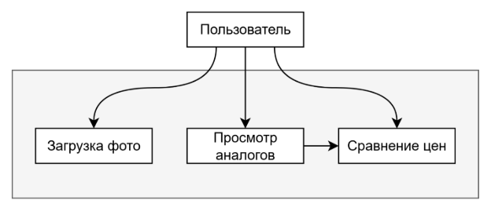

Документ о требованиях к продукту (PRD): Помощник по покупкам с искусственным интеллектом - “Ценовая линза” - Варианты использования

В этом документе подробно описаны варианты использования помощника по покупкам с искусственным интеллектом - “Ценовая линза”.

I. Основной вариант использования: Проверка цен в магазине с помощью распознавания изображений.

Описание: Пользователь в обычном магазине использует Price Lens, чтобы сфотографировать товар или отсканировать штрих-код. Искусственный интеллект идентифицирует товар, извлекает цену и отображает список онлайн-магазинов с их ценами.

Счастливый путь (успешный сценарий):

Пользователь открывает приложение: Пользователь запускает мобильное приложение Price Lens.

Пользователь инициирует проверку цен: Пользователь нажимает кнопку “Сканировать товар”, активируя камеру устройства.

Съемка товара: пользователь наводит камеру на штрих-код товара или делает четкое фото товара и его ценника.

Загрузка изображения: Приложение автоматически загружает изображение на сервер Price Lens AI.

Обработка с помощью искусственного интеллекта: ИИ на сервере обрабатывает изображение:

Распознавание товара: Искусственный интеллект идентифицирует товар с помощью распознавания изображений или сканирования штрих-кода.

Извлечение цены: технология распознавания текста извлекает цену из изображения ценника.

Сравнение цен: Сервер выполняет поиск идентифицированного товара в интернет-магазинах и извлекает их цены.

Отображение результатов: Приложение отображает список розничных продавцов, продающих данный товар, а также их цены (включая цену на оригинальном изображении), рейтинг товара и ссылку на покупку.

Пользователь выбирает действие: Пользователь просматривает и решает, что делать (например, купить в магазине, купить онлайн, сохранить продукт на потом).

Пользователь покидает приложение: Пользователь выходит из приложения.

Альтернативные сценарии:

**Нет подключения к Интернету:**

Сценарий: Пользователь находится в магазине с плохим подключением к Интернету или вообще без него.

Действие: Приложение отображает сообщение о том, что для сравнения цен требуется подключение к Интернету. Пользователю предлагается повторить попытку позже или подключиться к Wi-Fi.

Полезность для пользователя: позволяет избежать отображения неточной или неполной информации о ценах. Информирует пользователя о проблеме и предлагает решение.

**Неверный ввод данных (низкое качество изображения):**

Сценарий: Пользователь делает размытую или плохо освещенную фотографию продукта или ценника, что затрудняет идентификацию продукта и определение цены искусственным интеллектом.

Действие: Приложение отображает сообщение, предлагающее пользователю повторно сделать снимок при лучшем освещении или с более четким фокусом.

Ценность для пользователя: уменьшает количество ошибок и обеспечивает точное сравнение цен, предоставляя обратную связь пользователю.

Обработка ошибок:

**Технический сбой (недоступен сервис искусственного интеллекта):**

Сценарий: Сервер Price Lens AI временно недоступен из-за технической неполадки.

Действие: Приложение отображает сообщение об ошибке, указывающее на то, что услуга недоступна, и предлагает повторить попытку позже. В нем также содержится понятное описание ошибки.

Ценность для пользователя: предотвращает разочарование и обеспечивает прозрачность в отношении доступности услуг.

**Неверный ввод продукта (ИИ не может распознать продукт):**

Сценарий: ИИ не может идентифицировать продукт по изображению или штрих-коду (например, неизвестный продукт или малоизвестный бренд).

Действие: Приложение отображает сообщение о том, что продукт не удалось идентифицировать, и предоставляет возможность вручную ввести название продукта для сравнения цен.

Пользовательское значение: Предоставляет резервный механизм, позволяющий пользователю по-прежнему выполнять поиск и сравнение цен.

**Достигнут предел сравнения цен (ограничения на использование API):**

Сценарий: Приложение превышает дневной лимит на запросы API к сервисам сравнения цен.

Действие: Приложение отображает сообщение, информирующее пользователя об ограничении и предлагающее повторить попытку завтра или перейти на премиум-аккаунт для более высоких лимитов использования.

Ценность для пользователя: управляет ожиданиями пользователя и предоставляет варианты продолжения использования сервиса.

II. Use case UML-диаграмма

